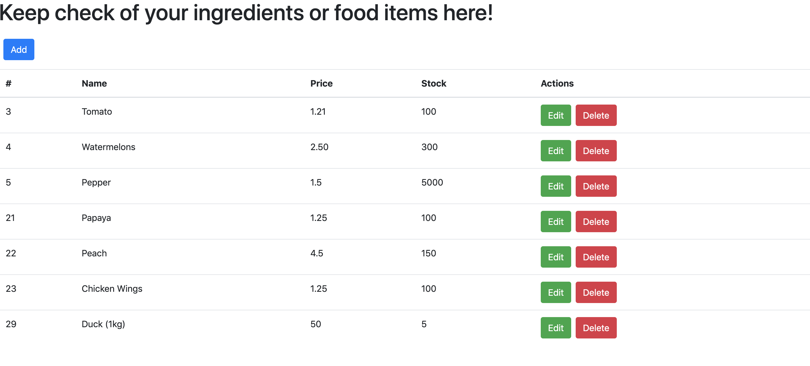

## Assignment B4

A very simple SPA that uses React, ReactStrap and Bootstrap that allows users to do restful API with a front-end. It uses the lambda functions that were implemented on assignment B3. 

[Link to the Assignment B1 - B3](https://github.com/kester-ng/Assignment-2)

### How to start up the front-end
 
 1. In your terminal or command prompt, make sure you are in the ingredient-app directory (contains `app.js`).

 2. type in `yarn start` to see the website.

 3. Play around and enjoy! 

 Here is the image for your reference!

 