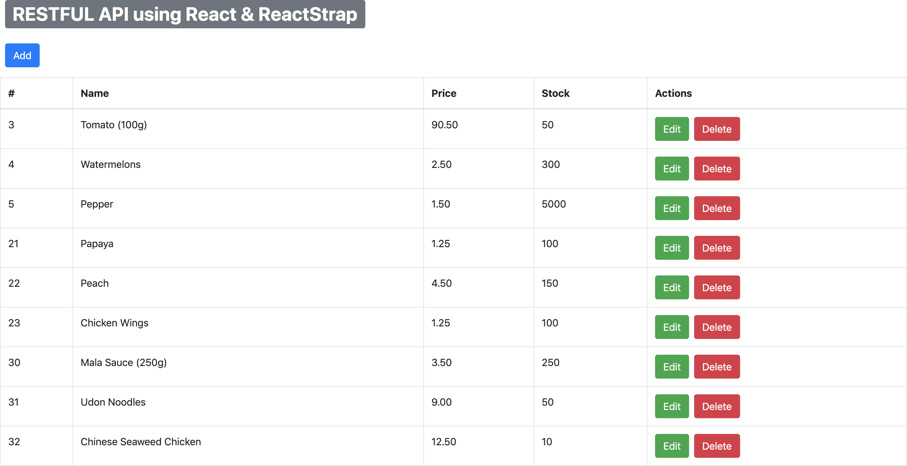

## Assignment B4

A very simple SPA that uses React, ReactStrap and Bootstrap that allows users to do restful API with a front-end. It uses the lambda functions that were implemented on assignment B3. 

[Link to the Assignment B1 - B3](https://github.com/kester-ng/Assignment-2)

### How to start up the front-end
 
 1. In your terminal or command prompt, make sure you are in the ingredient-app directory (contains `app.js`).
 
 2. Type in `yarn install` to install all the dependencies.

 3. type in `yarn start` to see the website.

 4. Play around and enjoy! 

 5. Do note that the CRUD functions may have some delays (since it is using AWS Lambda). So give it few seconds if nothing pops up or is updated!

 Here is the image for your reference!

 
